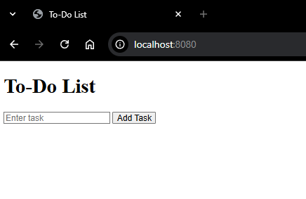
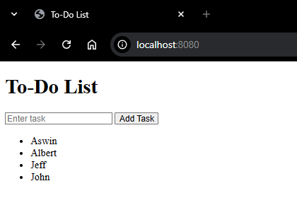
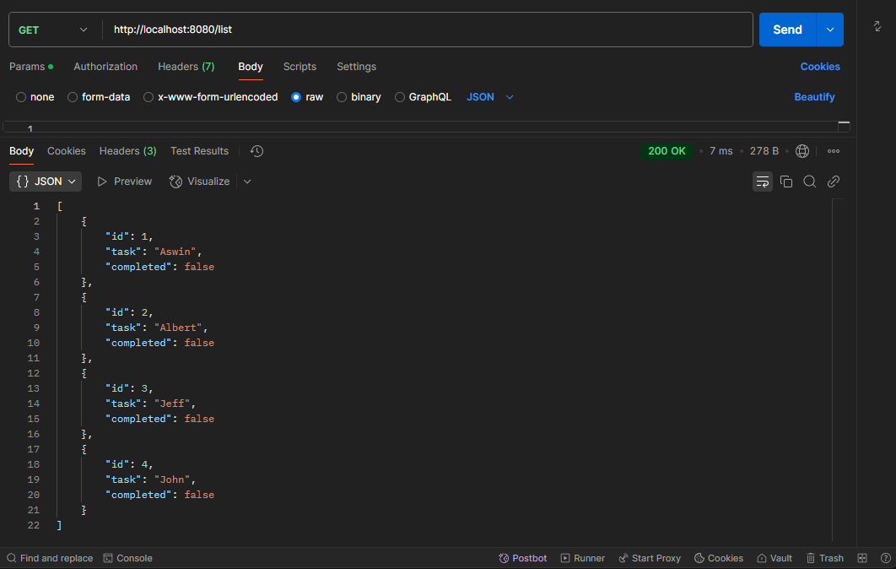
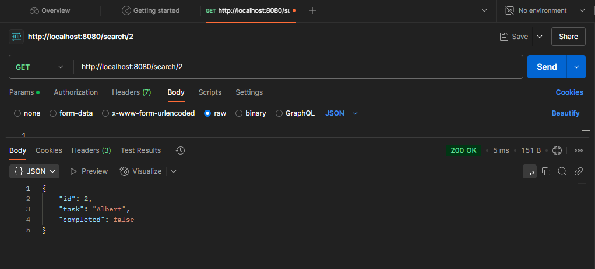
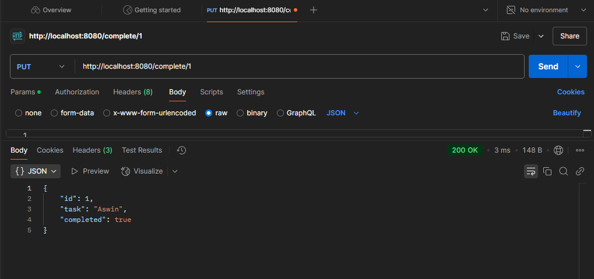
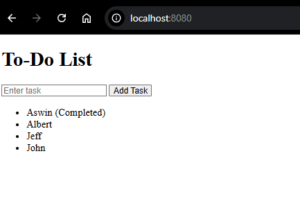
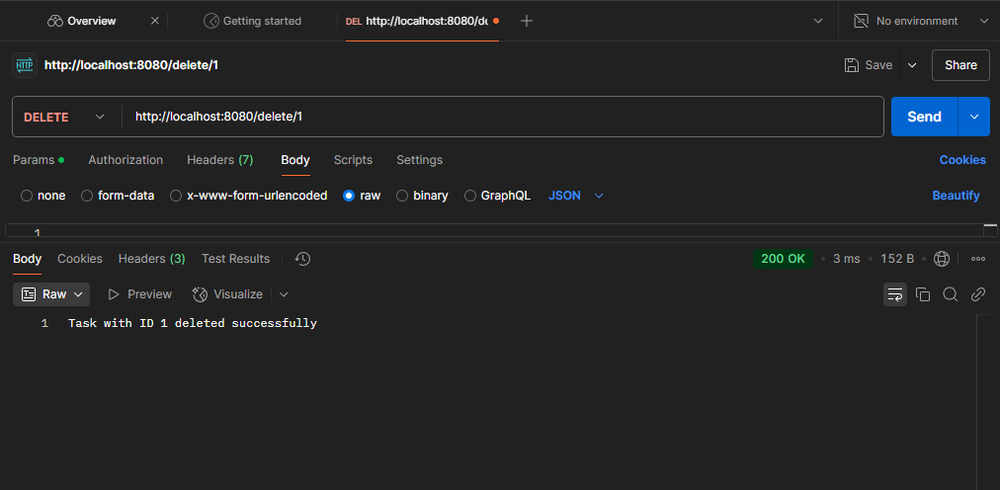
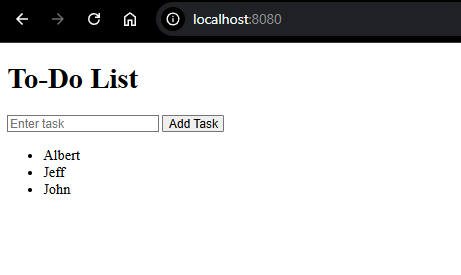

To-Do List API

📌 Overview

This project is a simple To-Do List API built using Go, HTML, and JavaScript. It provides basic functionalities to create, list, search, update (mark as completed), and delete tasks. The front end allows users to interact with the API using a simple web interface.

🚀 Features

Create new To-Do tasks ✅

List all tasks 📋

Search for a specific task by ID 🔍

Mark a task as completed 🏁

Delete a task ❌

📂 Project Structure


todo-list-api
├── static/           # Frontend assets (HTML, JS, CSS)
│   ├── index.html    # Web interface for managing To-Dos
│   ├── script.js     # JavaScript to interact with the API
├── main.go           # Go backend API implementation
├── README.md         # Documentation

🛠️ Setup and Installation

Prerequisites

Install Go

Install Postman (optional, for testing API endpoints)

Steps to Run


1. Clone the Repository
2. Run the Server
go run main.go
3. Open your browser and go to:
http://localhost:8080



🔗 API Endpoints

1️⃣ Create a New Task

Endpoint: POST /create

Request Body:
```go
{
  "task": "Learn Go",
  "completed": false
}
```

Response:
```go
{
 "id": 1,
  "task": "Learn Go",
  "completed": false
}
```



2️⃣ List All Tasks

Endpoint: GET /list

Response:
```go
[
  {
    "id": 1,
    "task": "Learn Go",
    "completed": false
  }
]
```



3️⃣ Search for a Task by ID

Endpoint: GET /task/{id}

Response:
```go
{
  "id": 1,
  "task": "Learn Go",
  "completed": false
}
```




4️⃣ Mark a Task as Completed
Endpoint: PUT /update/{id}

Response:
```go
{
  "id": 1,
  "task": "Learn Go",
  "completed": true
}
```





5️⃣ Delete a Task

Endpoint: DELETE /delete/{id}

Response:
```go
{
  "message": "Task deleted successfully"
}
```





📜 License

This project is open-source and available under the MIT License. Feel free to modify and use it as needed.

💡 Future Enhancements

Add database support (e.g., PostgreSQL, MySQL)

Implement user authentication

Create a more advanced frontend