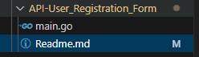
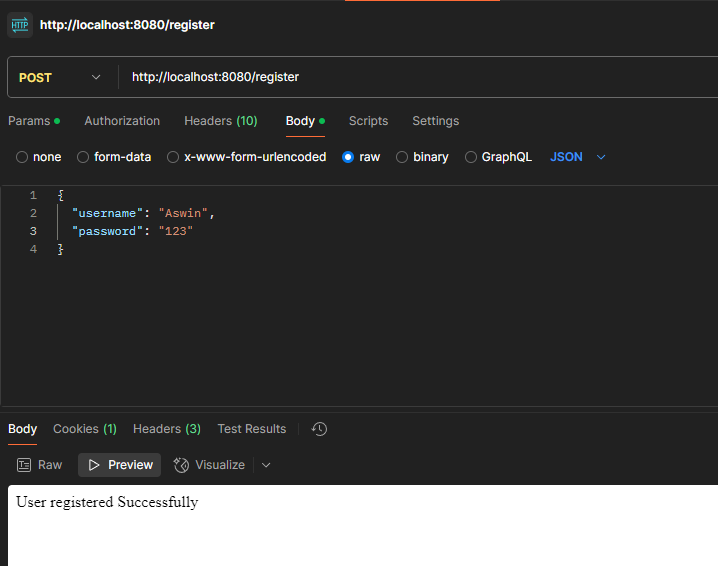
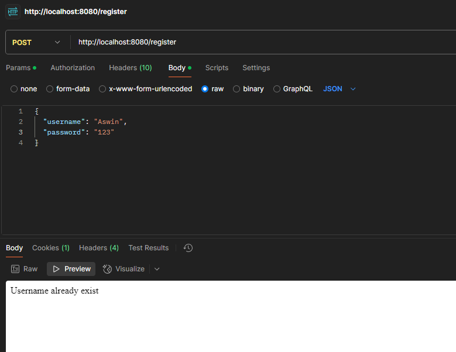
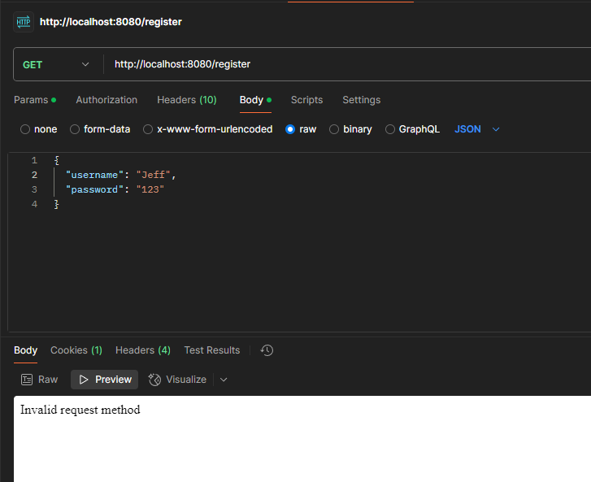
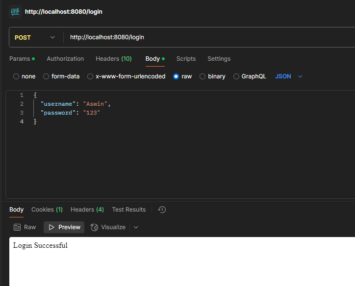
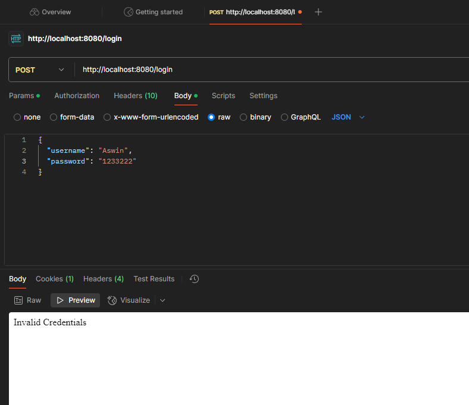

# Login form API using Go

# 📌 Overview

This is a user authentication API built in Go. 
It allows users to register, log in, and manage their sessions using cookies. 
The project uses an in-memory map to store user data and bcrypt for secure password hashing.

# 🚀 Features

User Registration: Register a new user with a username and password.

User Login: Log in with a username and password to receive a session cookie.

Session Management: Uses cookies to manage user sessions.

Secure Password Hashing: Passwords are hashed using bcrypt for secure storage.

# 📂 Project Structure



# 🛠️ Setup and Installation

Prerequisites

Install Go

Install Postman (optional, for testing API endpoints)

Steps to Run


1. Clone the Repository
2. Run the Server
go run main.go
3. Open your browser and go to:
http://localhost:8080


🔗 API Endpoints

# 1️⃣ Register a User

Endpoint: /register

Method: POST

Request Body:
```go
{
  "username": "alice",
  "password": "password123"
}
```

Response:

```go

Success Response:

Status Code: 201 Created

Body: User registered successfully

Error Responses:

400 Bad Request: Invalid input (e.g., missing username or password).

409 Conflict: Username already exists.

```

Register a user




Add an existing user again




Choose wrong http Method





# 2️⃣ Log In

Endpoint: /login

Method: POST

Request Body:

```go
{
  "username": "alice",
  "password": "password123"
}
```
Login Successful




Invalid login





# Dependencies

golang.org/x/crypto/bcrypt: For secure password hashing.

net/http: For handling HTTP requests and responses.

sync: For concurrency safety using mutexes.

# Security Considerations

Password Hashing: Passwords are hashed using bcrypt, which is resistant to brute-force attacks.

Session Cookies: Cookies are set with the HttpOnly and Secure flags for added security.

Concurrency Safety: A mutex is used to ensure safe access to the in-memory user store.

# Limitations

In-Memory Storage: User data is stored in memory and will be lost when the server restarts. For production, use a database like PostgreSQL or MongoDB.

No Logout Mechanism: The current implementation does not include a logout feature. You can clear the session cookie on the client side to log out.

No Rate Limiting: The API does not implement rate limiting, which could make it vulnerable to brute-force attacks.

# 📜 License

This project is open-source and available under the MIT License. Feel free to modify and use it as needed.

💡 Future Enhancements

Add a logout endpoint to clear the session cookie.

Implement rate limiting to prevent brute-force attacks.

Use a database for persistent user storage.

Add input validation for usernames and passwords (e.g., minimum length, allowed characters).

```go

=============================================================================
DEVELOPER: Aswin KS
DATE: 01-03-2025
ABOUT: Create login form API using Go
Functions added: User Creation, User Authentication, Session Management
===========================================================================

```