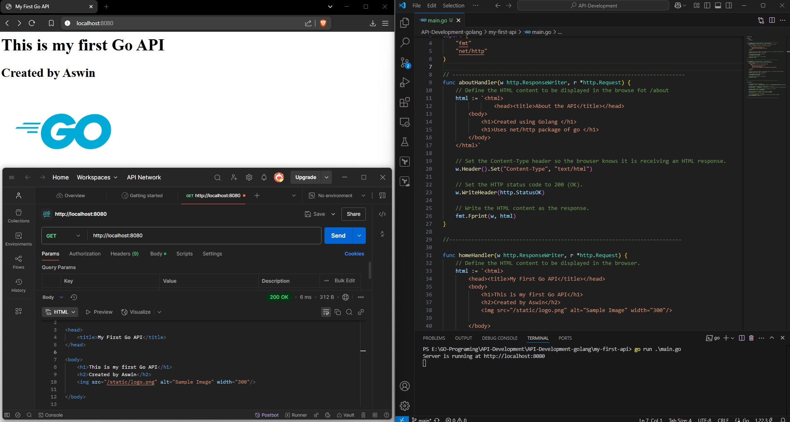

# Problem: Create an API using Go (Golang)

```markdown

Input: nums = [10, 20, 4, 45, 99]
Output: 45

```

# Key concepts Learned:

 ```markdown

Create an API that accept request at "/" and "/about"

```
# Result


```go
func main() {

	// Serve static files like images
	http.Handle("/static/", http.StripPrefix("/static/", http.FileServer(http.Dir("static"))))

	//Create a handler function that handles request to "/" path
	http.HandleFunc("/", homeHandler) //homeHandler is a user defined function created above that prints the messsage in the webpage

	//Create a handler function to display about page at path "/about"
	http.HandleFunc("/about", aboutHandler)

	//Print a message to indicate that the server is running
	fmt.Println("Server is running at http://localhost:8080")

	// Start the HTTP server on port 8080.
	// The second parameter is `nil` because we are using the default ServeMux.
	http.ListenAndServe(":8080", nil)
}
```
Function that handle the "/" path
```go
func homeHandler(w http.ResponseWriter, r *http.Request) {
	// Define the HTML content to be displayed in the browser.
	html := `<html>
		<head><title>My First Go API</title></head>
		<body>
			<h1>This is my first Go API</h1>
			<h2>Created by Aswin</h2>
			

		</body>
	</html>`

	// Set the Content-Type header so the browser knows it is receiving an HTML response.
	w.Header().Set("Content-Type", "text/html")

	// Set the HTTP status code to 200 (OK).
	w.WriteHeader(http.StatusOK)

	// Write the HTML content as the response.
	fmt.Fprint(w, html)

}

```

Function that handle the "/about" path

```go
func aboutHandler(w http.ResponseWriter, r *http.Request) {
	// Define the HTML content to be displayed in the browse fot /about
	html := `<html>
				<head><title>About the API</title></head>
		<body>
			<h1>Created using Golang </h1>
			<h1>Uses net/http package of go </h1>
		</body>
	</html>`

	// Set the Content-Type header so the browser knows it is receiving an HTML response.
	w.Header().Set("Content-Type", "text/html")

	// Set the HTTP status code to 200 (OK).
	w.WriteHeader(http.StatusOK)

	// Write the HTML content as the response.
	fmt.Fprint(w, html)
}


```

